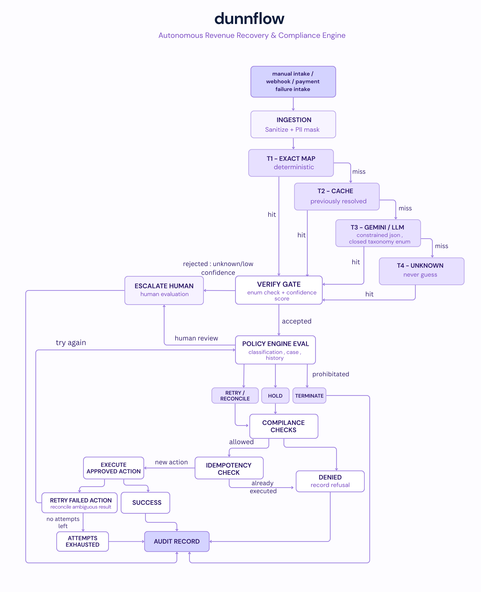

# dunnflow - Autonomous Revenue Recovery & Compliance Engine
**Track 03: AI Revenue Recovery**

**dunnflow** detects revenue slipping away (failed payments, checkout abandonment, overdue receivables), figures out *why*, picks the right intervention, and executes a *bounded* recovery workflow — with the bar being: show *measured* money recovered across a batch, compliant escalation, stopping rules, and an audit trail. 

##
## what it does

1. **Classifies Failures:** Uses a 4-tier cascade (Exact Map $\rightarrow$ Cache $\rightarrow$ Gemini LLM $\rightarrow$ Human Escalation)
2. **Selects Policy Directives:** Maps failure reasons to static, versioned YAML policy matrices
3. **Enforces Compliance:** Runs actions through 12 deterministic guardrails (attempt caps, velocity limits, kill switch)
4. **Prevents Double Charges:** Uses action-aware idempotency keys and reconciles ambiguous gateway timeouts
5. **Cryptographic Auditing:** Commits every state transition to an append-only SHA-256 hash-chained ledger
6. **Measures Yield:** Benchmarks recovery rate, recovered amount, and duplicate charges against a control baseline (`ARM_DUNNFLOW`)

##  system architecture


<p align="center">
  
</p>

##

## tech stack

| Domain | Tech | Selection Rationale |
| :--- | :--- | :--- |
| **Backend** | Python 3.13 / FastAPI | Async-native pipeline with Pydantic v2 schemas generating API contracts |
| **Orchestration** | LangGraph | Durable state-machine executor with strictly deterministic routing |
| **Database** | PostgreSQL 16 + SQLAlchemy (async) | Single ACID transactional store backing state updates and hash-chained audit logs |
| **Idempotency** | Redis 7 | Distributed `SETNX` locks to prevent duplicate execution across restarts |
| **Policy Engine** | PyYAML 6.0+ | Version-controlled, SHA-pinned YAML matrices for zero-I/O rule evaluation |
| **AI Classifier** | Google Gemini API  | Tier-3 fallback classifier constrained to output closed taxonomy enums |
| **Frontend** | React 19 / TypeScript 5.7 | Single-Page Application (SPA) mirroring backend Pydantic types |
| **Tooling & Styling** | Vite 8 / Tailwind CSS v4 | Fast HMR dev server and utility-first styling for a dense data console |
| **Infra & Test** | Docker Compose / pytest + Hypothesis | Containerized stateful services with property-based testing for policy invariants |

##

## getting started

### Prerequisites
* Python 3.11+
* Node.js 18+ & npm/pnpm
* Docker (optional)

### Backend Setup
```bash
# Clone the repository
git clone [https://github.com/your-username/dunnflow.git](https://github.com/your-username/dunnflow.git)
cd dunnflow/backend

# Create virtual environment
python -m venv venv
source venv/bin/activate  # On Windows: venv\Scripts\activate

# Install dependencies
pip install -r requirements.txt

# Start FastAPI server
uvicorn main:app --reload --port 8000

```

### Frontend Setup
```

# Navigate to frontend directory
cd ../frontend

# Install dependencies
npm install

# Start development server
npm run dev

```


[](LICENSE)
[](https://python.org)
[](https://fastapi.tiangolo.com)
[](https://nextjs.org)
